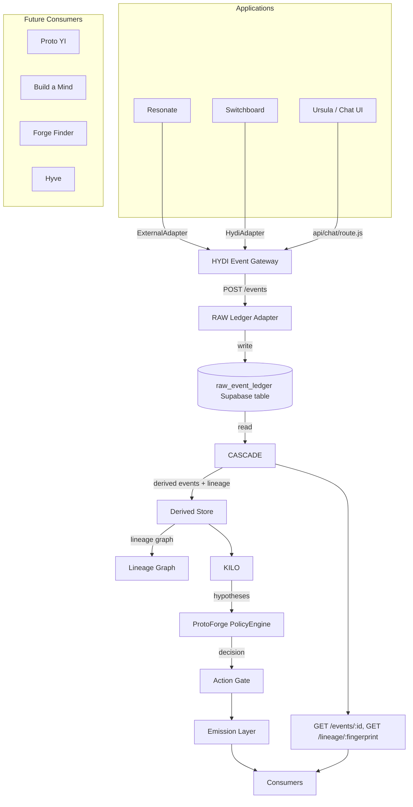
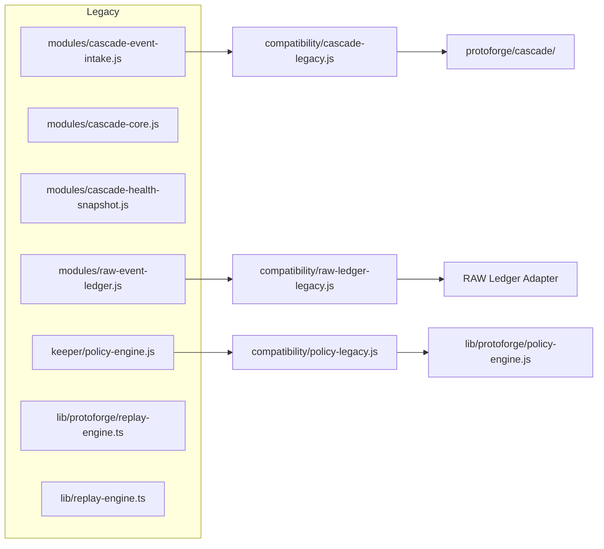

# Platform Dependency Graph

## Canonical data flow

## Dependency table

| Consumer | Depends on | Direct import / call | Status |
|---|---|---|---|
| Resonate | HYDI Event Gateway | `ExternalAdapter` → `POST /events` | Active |
| Switchboard | HYDI Event Gateway | `HydiAdapter` → `POST /events` | Active |
| HYDI Event Gateway | RAW Ledger Adapter | `src/adapters/raw-ledger.js` → Supabase | Active |
| CASCADE | RAW Ledger Adapter | `src/adapters/ledger-adapter.js` → Supabase `raw_event_ledger` | Active |
| CASCADE | Derived Store | `src/derived-store.js` (local JSON) | Active |
| CASCADE | Lineage Graph | `src/derived-store.js` `LineageGraph` | Active |
| KILO | CASCADE | (planned) consumes derived events | Reserved |
| ProtoForge | KILO output | `lib/protoforge/policy-engine.js` | Active |
| Action Gate | KILO + PolicyEngine | `lib/protoforge/action-gate.ts` | Active |
| Emission | Action Gate | `lib/event-bus/`, `api/events/stream.js` | Active |
| Chat UI | Chat Router | `api/chat/route.js` | Active (legacy stubs) |

## Legacy dependency graph

## Direction of travel

1. All new consumers must read from `protoforge/cascade/` derived events, not the RAW LEDGER directly.
2. All new producers must write through `protoforge/hydi-gateway/`, not `modules/raw-event-ledger.js`.
3. All policy decisions must use `lib/protoforge/policy-engine.js`.
4. All replay must use `protoforge/cascade/src/replay.js`.
