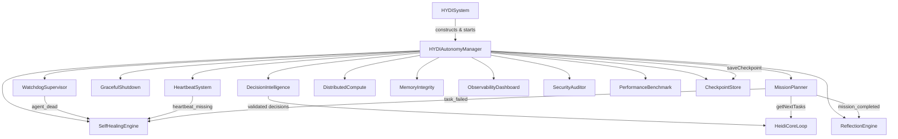

# HYDI V3 Architecture Guide

This document describes the architecture of the HYDI V3 reliability and autonomy layer, the module boundaries, and the dependency flow between `src/hydi-v3` and the existing V2 core.

## Design Goals

- **Non-invasive layering**: V3 wraps around V2 (`src/HYDISystem.js`) without redesigning the pipeline.
- **Mission-oriented execution**: replace isolated tasks with missions, objectives, dependencies, and priorities.
- **Reliability by default**: watchdog, heartbeat, graceful shutdown, checkpointing, self-healing, and memory integrity run continuously.
- **Observable and auditable**: every decision, mission, heartbeat, and recovery event is recorded.
- **Revenue-aware**: missions can carry revenue targets, and reflection surfaces best/worst strategies.

## Module Inventory

| Module | File | Responsibility |
|--------|------|----------------|
| `HYDIAutonomyManager` | `AutonomyManager.js` | Central orchestrator, lifecycle, patches, and status aggregation |
| `WatchdogSupervisor` | `WatchdogSupervisor.js` | Detects dead loops, blocked promises, high resource use, heartbeat timeout |
| `HeartbeatSystem` | `HeartbeatSystem.js` | Publishes and monitors per-service heartbeats |
| `GracefulShutdown` | `GracefulShutdown.js` | Captures signals and uncaught errors, flushes handlers, exits cleanly |
| `DecisionIntelligence` | `DecisionIntelligence.js` | Records and validates every autonomous decision |
| `MissionPlanner` | `MissionPlanner.js` | Mission/objective/task hierarchy, dependencies, scheduling, replanning |
| `ReflectionEngine` | `ReflectionEngine.js` | Post-mission reflections and decaying strategy rankings |
| `SelfHealingEngine` | `SelfHealingEngine.js` | Diagnoses symptoms, retries with backoff, escalates |
| `DistributedCompute` | `DistributedCompute.js` | Node registry, scheduling, heartbeat, work redistribution |
| `MemoryIntegrity` | `MemoryIntegrity.js` | Scans memory stores for corruption, duplicates, and orphans |
| `ObservabilityDashboard` | `ObservabilityDashboard.js` | Metrics, dashboards, Prometheus export |
| `SecurityAuditor` | `SecurityAuditor.js` | Secret scanning, input validation, encryption helpers |
| `TestingFramework` | `TestingFramework.js` | Long-running and failure-mode simulations |
| `PerformanceBenchmark` | `PerformanceBenchmark.js` | Startup, mission planning, queue, DB, memory, dispatch benchmarks |
| `CheckpointStore` | `CheckpointStore.js` | Persisted execution state for power-loss recovery |

## Layer Boundaries

```
┌─────────────────────────────────────────────────────────────┐
│                     V2 Core (unchanged)                      │
│  HYDISystem → HeidiCoreLoop → Orchestrator → Action Layer   │
└─────────────────────────────────────────────────────────────┘
                              │
                              ▼
┌─────────────────────────────────────────────────────────────┐
│            HYDI V3 Reliability & Autonomy Layer              │
│  ┌─────────────────────────────────────────────────────┐   │
│  │ HYDIAutonomyManager                                 │   │
│  │  - wires V2 core components                         │   │
│  │  - patches coreLoop.getPendingTasks()               │   │
│  │  - patches coreLoop.takeAction()                    │   │
│  └─────────────────────────────────────────────────────┘   │
│  ┌──────────────┐ ┌──────────────┐ ┌──────────────┐       │
│  │  Watchdog    │ │  Heartbeat   │ │  Graceful    │       │
│  │  Supervisor  │ │  System      │ │  Shutdown    │       │
│  └──────────────┘ └──────────────┘ └──────────────┘       │
│  ┌──────────────┐ ┌──────────────┐ ┌──────────────┐       │
│  │  Decision    │ │   Mission    │ │  Reflection  │       │
│  │  Intelligence│ │   Planner    │ │   Engine     │       │
│  └──────────────┘ └──────────────┘ └──────────────┘       │
│  ┌──────────────┐ ┌──────────────┐ ┌──────────────┐       │
│  │  SelfHealing │ │  Distributed │ │  Memory      │       │
│  │  Engine      │ │  Compute     │ │  Integrity   │       │
│  └──────────────┘ └──────────────┘ └──────────────┘       │
│  ┌──────────────┐ ┌──────────────┐ ┌──────────────┐       │
│  │  Observability│ │  Security    │ │  Performance │      │
│  │  Dashboard   │ │  Auditor     │ │  Benchmark   │       │
│  └──────────────┘ └──────────────┘ └──────────────┘       │
└─────────────────────────────────────────────────────────────┘
                              │
                              ▼
┌─────────────────────────────────────────────────────────────┐
│                    Persistence (`data/`)                     │
│  missions.json, decision_history.json, reflections.json,     │
│  checkpoints/latest.json                                     │
└─────────────────────────────────────────────────────────────┘
```

## Dependency Flow

1. `HYDISystem` constructs `HYDIAutonomyManager` in `initializeLayers()` (`src/HYDISystem.js`, line 165).
2. `HYDISystem.start()` calls `autonomyManager.start()` before `coreLoop.start()` (line 306).
3. `HYDIAutonomyManager` constructs all V3 modules and then:
   - restores `CheckpointStore` (`AutonomyManager.js` line 100),
   - starts `DistributedCompute`, `SelfHealing`, `MemoryIntegrity`, `Watchdog`, `Heartbeat`,
   - patches `coreLoop.getPendingTasks()` (line 250) and `coreLoop.takeAction()` (line 261),
   - begins recording observability snapshots every 30 seconds (line 149).
4. `MissionPlanner.getNextTasks()` is returned by the patched `coreLoop.getPendingTasks()` when missions have ready tasks.
5. `DecisionIntelligence.validateDecision()` is called in the patched `coreLoop.takeAction()` before execution.
6. `Watchdog` emits `agent_dead` to `SelfHealingEngine` (`AutonomyManager.js` line 85, 295).
7. `Heartbeat` emits `heartbeat_missing` to `SelfHealingEngine` (line 86, 299).
8. `MissionPlanner` emits `mission_completed` to `ReflectionEngine` (line 87, 305) and `task_failed` to `SelfHealingEngine` (line 88, 313).

## Module Interaction Diagram



## Data Persistence

All persistent V3 state lives under `data/` (or `config.dataPath`):

- `data/missions/missions.json` — `MissionPlanner` serializes missions and tasks.
- `data/decisions/decision_history.json` — `DecisionIntelligence` decision log.
- `data/reflections/reflections.json` — `ReflectionEngine` reflections and rankings.
- `data/checkpoints/latest.json` — `CheckpointStore` runtime snapshot.

## Key Architectural Constraints

- V3 modules must not mutate V2 state directly; they only patch `getPendingTasks` and `takeAction`.
- `takeAction` rejects decisions that are dangerous, low-confidence, or missing credentials/resources.
- `MissionPlanner` serializes Maps to plain objects via `_mapReplacer` (`MissionPlanner.js` line 443) so JSON persistence is deterministic.
- `GracefulShutdown` is disabled by default when HYDI is started by `HYDISystem`; `boot-agent.js` owns signal handling.
- All V3 modules expose `destroy()` to clean up timers, Maps, and listeners in tests.

## Concurrency

- `maxConcurrent` default is `5` (configurable in `MissionPlanner` and `AutonomyManager`).
- `getNextTasks(capacity)` returns the highest-priority, deadline-ordered tasks whose dependencies are `completed`.
- `Watchdog` and `Heartbeat` check at 30-second intervals with a 90-second timeout.
- `SelfHealingEngine` uses exponential backoff up to 60 seconds and a default 5-attempt limit.
