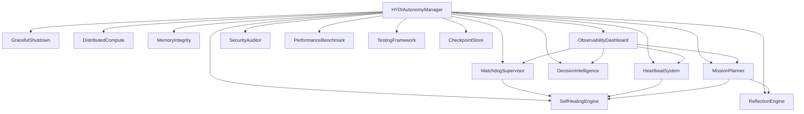

# HYDI V3 Class/Component Diagrams

This document describes the class and component relationships in `src/hydi-v3`.

## Component Overview

## Class Diagram

```mermaid
classDiagram
    class HYDIAutonomyManager {
        +EventEmitter
        +config: object
        +coreLoop: object
        +orchestrator: object
        +memorySystem: object
        +actionLayer: object
        +modelStack: object
        +start()
        +stop()
        +createMission(name, objective, options)
        +executeMission(missionId)
        +runSecurityAudit()
        +runMemoryIntegrity()
        +runPerformanceBenchmarks()
        +runTestSuite()
        +getStatus()
        +getDashboard()
        +destroy()
    }

    class WatchdogSupervisor {
        +config: object
        +agents: Map
        +registerAgent(agentId, agent, metadata)
        +start()
        +stop()
        +checkAgents()
        +attemptRecovery(agentId, entry, status)
        +restartAgent(agentId)
        +getStatus()
        +destroy()
    }

    class HeartbeatSystem {
        +config: object
        +heartbeats: Map
        +publishers: Map
        +registerPublisher(serviceId, provider, metadata)
        +publish(serviceId, heartbeat)
        +publishAll()
        +checkHeartbeats()
        +getStatus()
        +destroy()
    }

    class GracefulShutdown {
        +config: object
        +handlers: Array
        +addHandler(handler, priority)
        +install()
        +uninstall()
        +shutdown(exitCode, reason)
        +onSignal(signal)
        +onException(error)
        +onRejection(reason, promise)
        +destroy()
    }

    class DecisionIntelligence {
        +config: object
        +decisions: Array
        +makeDecision(input, context)
        +validateDecision(decision, context)
        +recordOutcome(decisionId, outcome)
        +recordDecision(task, decision, measurement)
        +searchHistory(filters)
        +getStatus()
        +persist()
        +destroy()
    }

    class MissionPlanner {
        +EventEmitter
        +config: object
        +missions: Map
        +activeTasks: Map
        +createMission(name, objective, options)
        +addObjective(missionId, objective)
        +addTask(missionId, task, options)
        +planMission(missionId)
        +getNextTasks(capacity)
        +startTask(taskId, missionId)
        +completeTask(taskId, missionId, result)
        +failTask(taskId, missionId, error)
        +replanMission(missionId)
        +getMission(missionId)
        +getMissions(filters)
        +getStatus()
        +persist()
        +destroy()
    }

    class ReflectionEngine {
        +EventEmitter
        +config: object
        +reflections: Array
        +strategyRankings: object
        +reflectOnMission(mission)
        +getBestStrategy(category)
        +getWorstStrategy(category)
        +getStrategyRankings(category)
        +getStatus()
        +persist()
        +destroy()
    }

    class SelfHealingEngine {
        +EventEmitter
        +config: object
        +attempts: Map
        +escalations: Map
        +memorySnapshots: Array
        +diagnose(symptom)
        +heal(symptom, actions)
        +executePlan(plan, actions)
        +check()
        +getStatus()
        +destroy()
    }

    class DistributedCompute {
        +EventEmitter
        +config: object
        +nodes: Map
        +workAssignments: Map
        +registerNode(node)
        +deregisterNode(nodeId)
        +heartbeat(nodeId, updates)
        +checkNodes()
        +schedule(task, filter)
        +scoreNode(node, weights)
        +redistributeWork(failedNodeId)
        +getStatus()
        +destroy()
    }

    class MemoryIntegrity {
        +EventEmitter
        +config: object
        +runScan(memoryStores)
        +verify(memoryStores)
        +isValidTimestamp(value)
        +getStatus()
        +destroy()
    }

    class ObservabilityDashboard {
        +EventEmitter
        +config: object
        +history: object
        +recordSnapshot(sources)
        +getDashboard(sources)
        +getCharts()
        +exportMetrics(format)
        +toPrometheus(dashboard)
        +getStatus()
    }

    class SecurityAuditor {
        +config: object
        +patterns: Array
        +runAudit()
        +scanFile(filePath, findings)
        +validateInput(input)
        +encrypt(plaintext, key)
        +decrypt(ciphertext, key)
        +rotateCredential(hint)
        +getStatus()
    }

    class CheckpointStore {
        +config: object
        +initialize()
        +saveCheckpoint(state)
        +loadCheckpoint()
    }

    HYDIAutonomyManager --> WatchdogSupervisor : uses
    HYDIAutonomyManager --> HeartbeatSystem : uses
    HYDIAutonomyManager --> GracefulShutdown : uses
    HYDIAutonomyManager --> DecisionIntelligence : uses
    HYDIAutonomyManager --> MissionPlanner : uses
    HYDIAutonomyManager --> ReflectionEngine : uses
    HYDIAutonomyManager --> SelfHealingEngine : uses
    HYDIAutonomyManager --> DistributedCompute : uses
    HYDIAutonomyManager --> MemoryIntegrity : uses
    HYDIAutonomyManager --> ObservabilityDashboard : uses
    HYDIAutonomyManager --> SecurityAuditor : uses
    HYDIAutonomyManager --> CheckpointStore : uses
```

## Key Relationships

- `HYDIAutonomyManager` owns one instance of each V3 module and mediates events.
- `MissionPlanner` owns `Mission` and `Task` objects and emits lifecycle events.
- `ReflectionEngine` consumes `mission_completed` events from `MissionPlanner`.
- `SelfHealingEngine` consumes `agent_dead` and `heartbeat_missing` events.
- `ObservabilityDashboard` reads status from `WatchdogSupervisor`, `MissionPlanner`, `DecisionIntelligence`, and `HeartbeatSystem`.
- `CheckpointStore` is used by `HYDIAutonomyManager` for shutdown and startup state.
