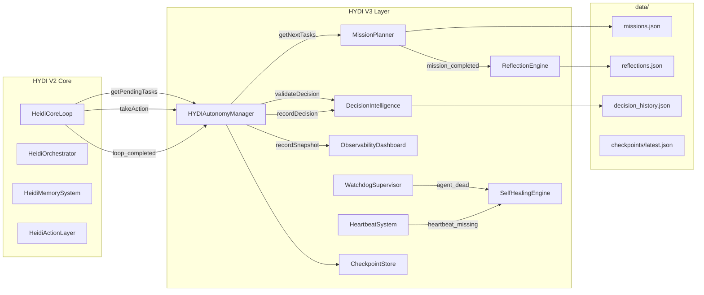
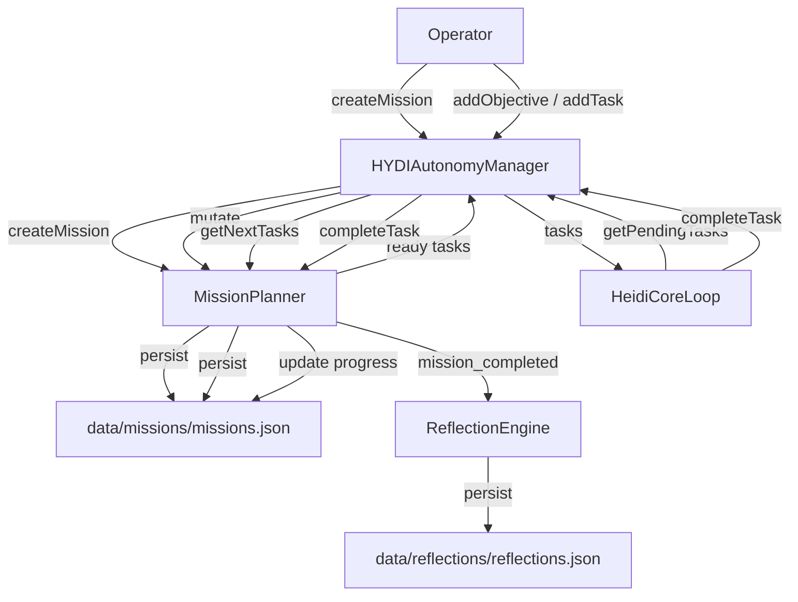
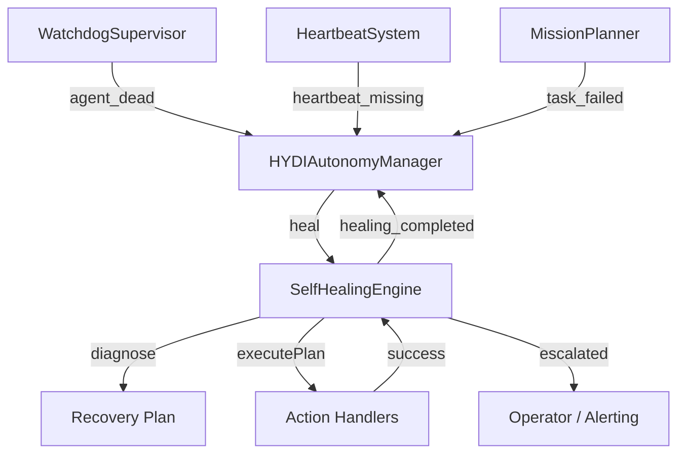
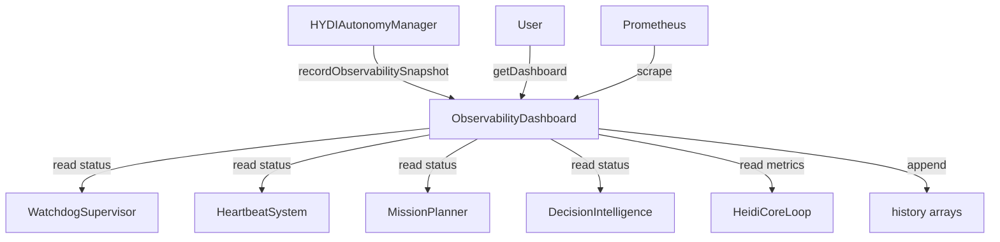
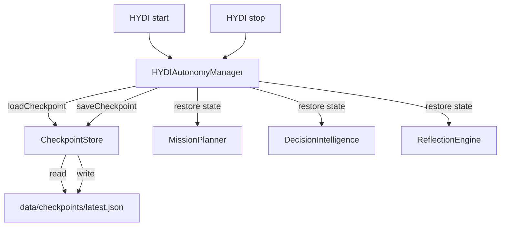

# HYDI V3 Data Flow Diagrams

This document describes how data flows between V2 core, V3 modules, persistence, and observability.

## High-Level Data Flow



## Mission Data Flow



## Decision Data Flow

```mermaid
flowchart TD
    CL[HeidiCoreLoop] -->|takeAction(task, decision)| AM[HYDIAutonomyManager]
    AM -->|validateDecision| DI[DecisionIntelligence]
    DI -->|load history| Decisions[data/decisions/decision_history.json]
    DI -->|valid / rejected| AM
    AM -->|originalTakeAction| CL
    CL -->|loop_completed| AM
    AM -->|recordDecision| DI
    DI -->|append| Decisions
```

## Recovery Data Flow



## Observability Data Flow



## Checkpoint Data Flow


