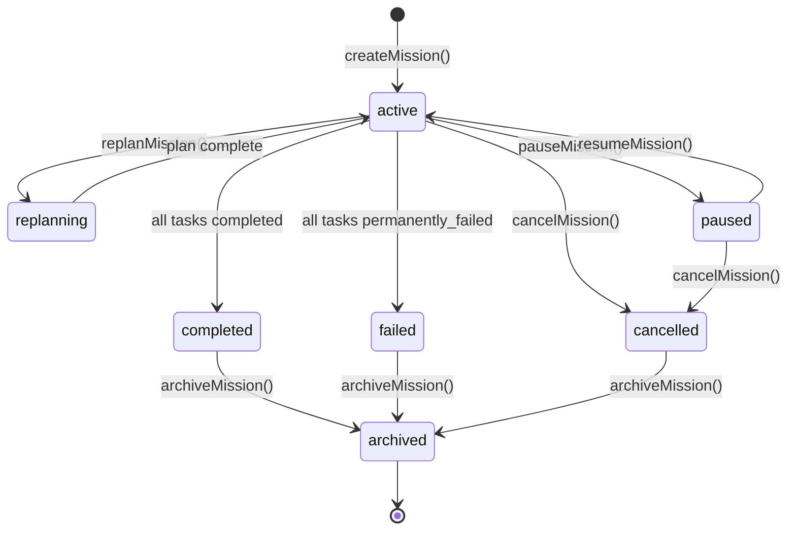
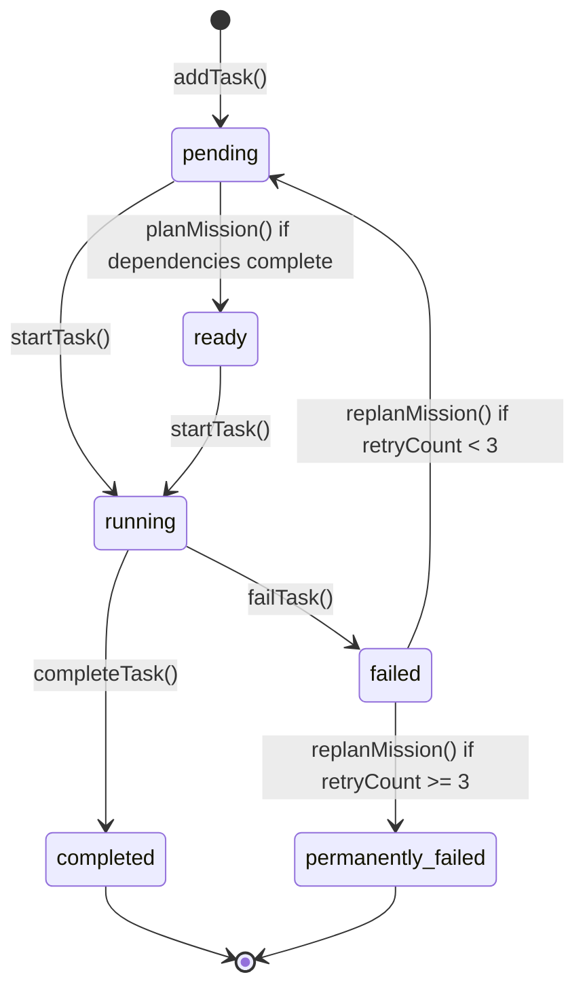
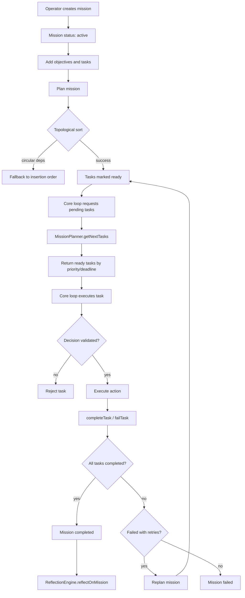

# HYDI V3 Mission Lifecycle Diagrams

This document describes the states and lifecycle of a mission and its tasks.

## Mission State Diagram

## Task State Diagram

## Mission Lifecycle Flow

## Task Dispatch Sequence

1. `MissionPlanner.planMission(missionId)` topologically sorts tasks.
2. `isTaskReady(mission, task)` returns `true` when:
   - `task.status === 'pending'`, and
   - all `task.dependencies` are completed.
3. `getNextTasks(capacity)` collects ready tasks across all active missions.
4. Tasks are sorted by:
   1. Priority (`critical` < `high` < `medium` < `low`)
   2. Deadline (earliest first)
   3. Created time (oldest first)
5. Top `capacity` tasks are returned to `coreLoop.getPendingTasks()`.

## Replanning Behavior

When `failTask()` is called and `autoReplan` is enabled:

- Increment `mission.failureCount`.
- If `task.retryCount < 3`:
  - Reset task to `pending` with `ready: true`.
- Else:
  - Mark task `permanently_failed`.
- Call `planMission()` again.
- `updateMissionProgress()` checks if the mission is completed or failed.
