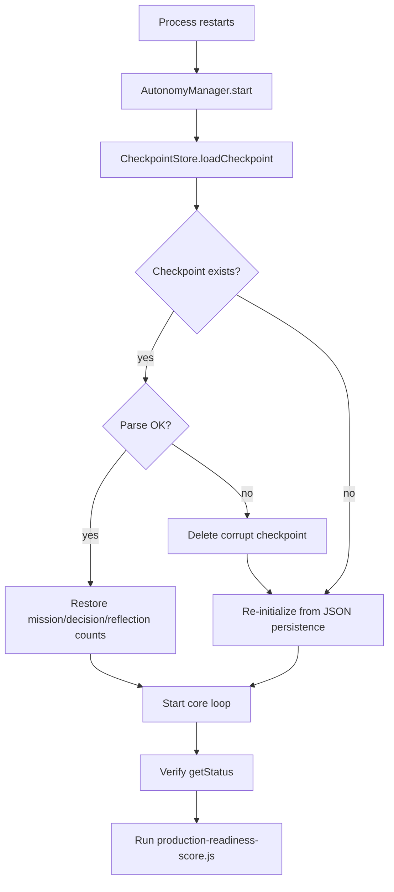
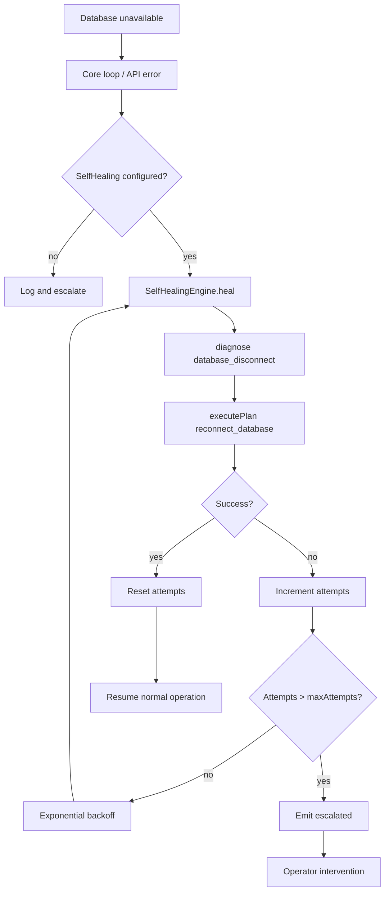
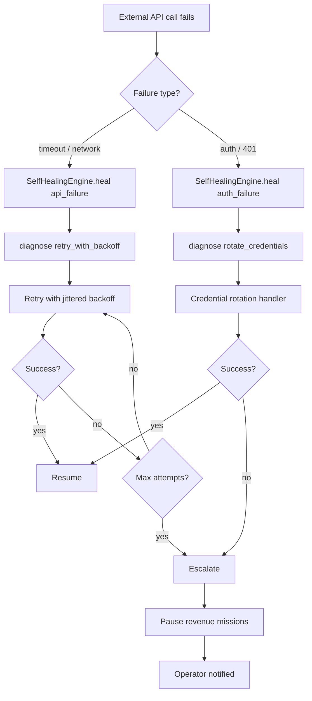
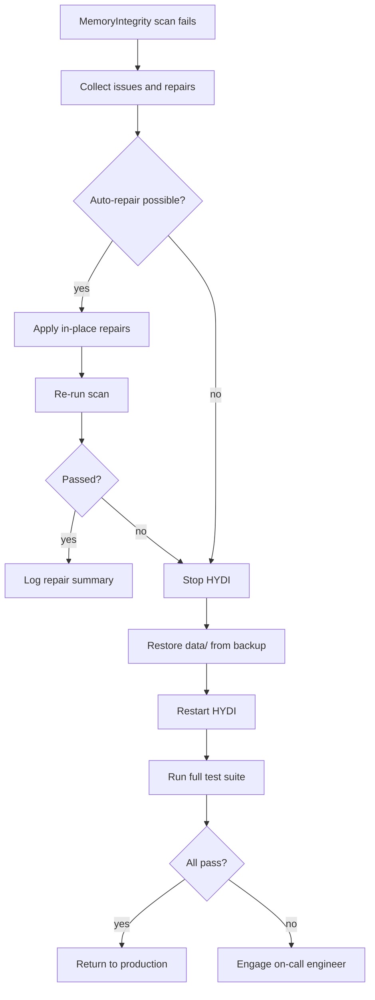
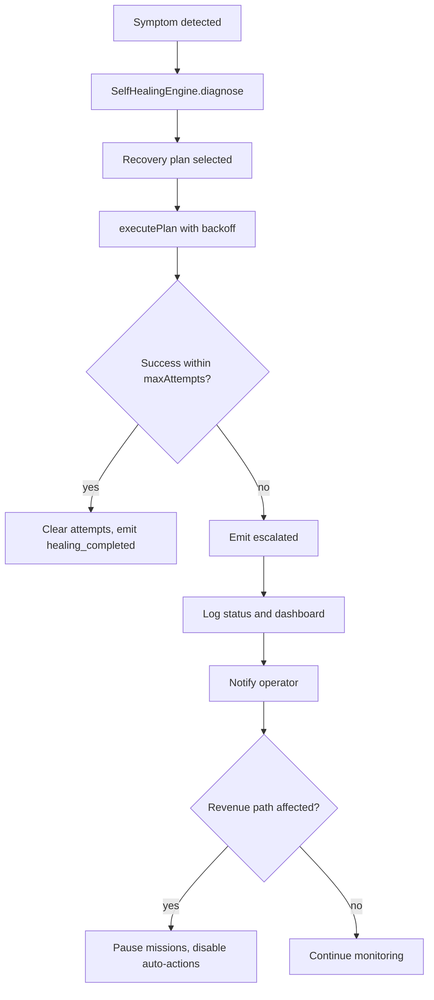

# HYDI V3 Recovery Flowcharts

This document contains recovery flowcharts for power loss, database outage, network outage, and corruption.

## Power Loss Recovery

## Database Outage Recovery

## Network Outage Recovery

## Corruption Recovery

## General Escalation Flow

