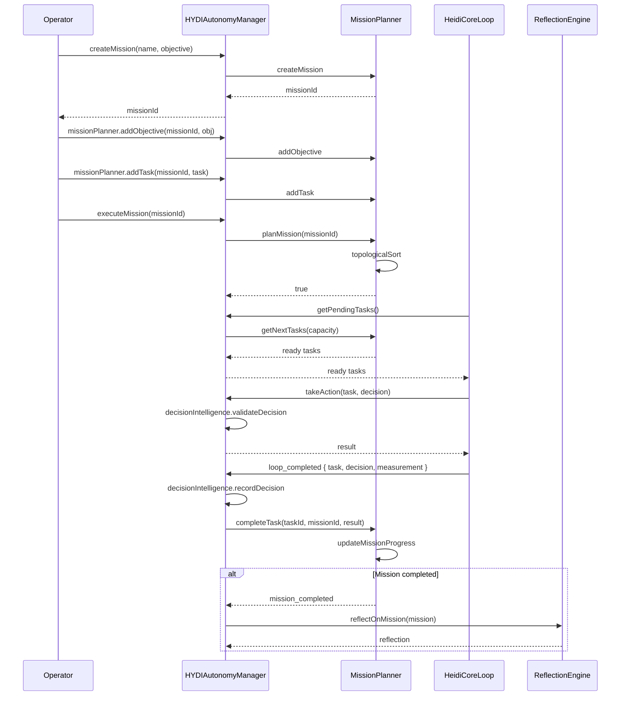
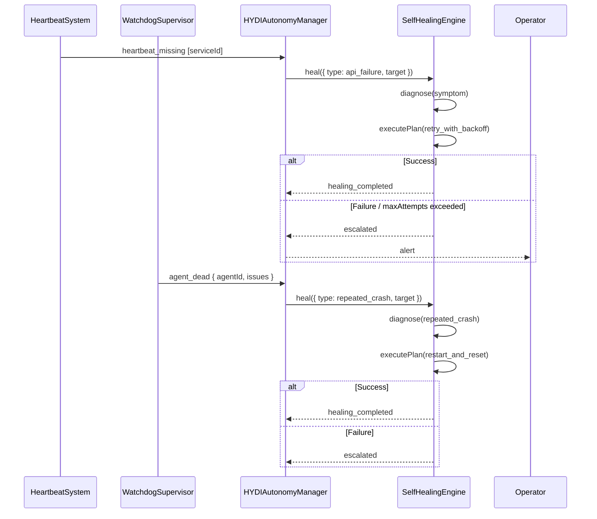
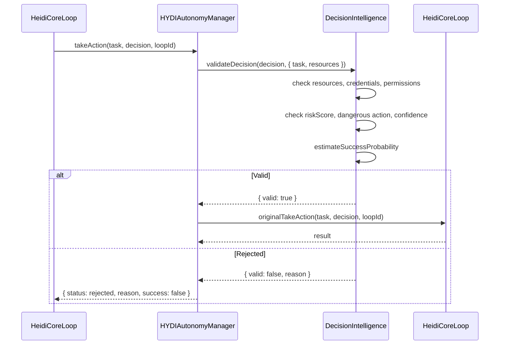
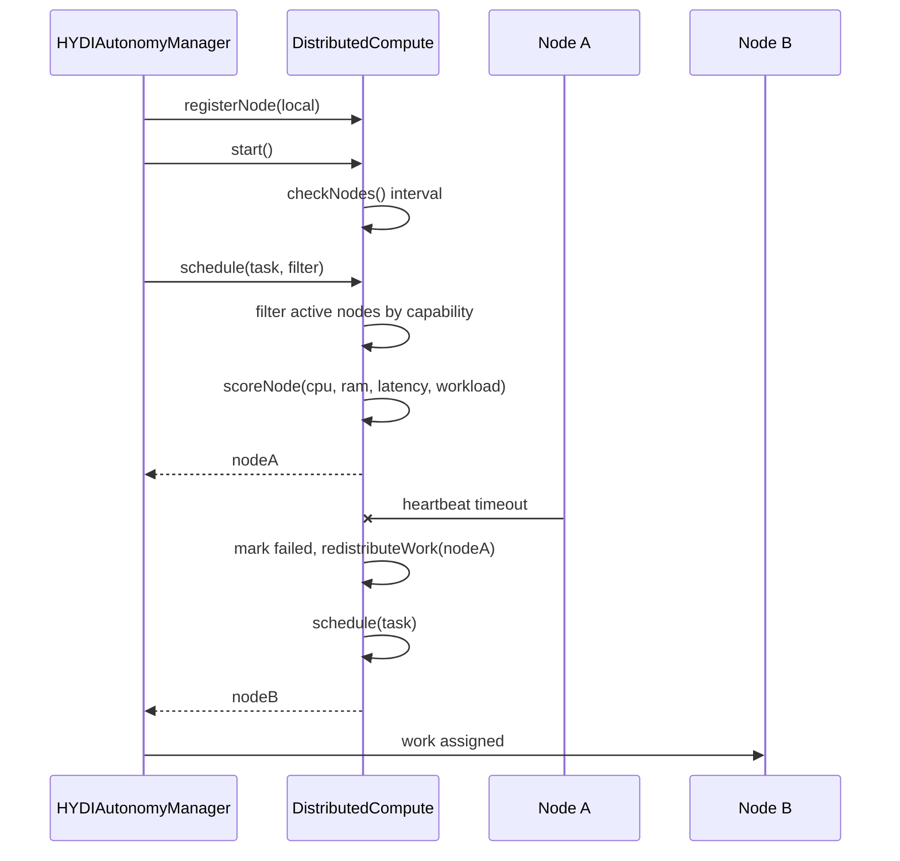
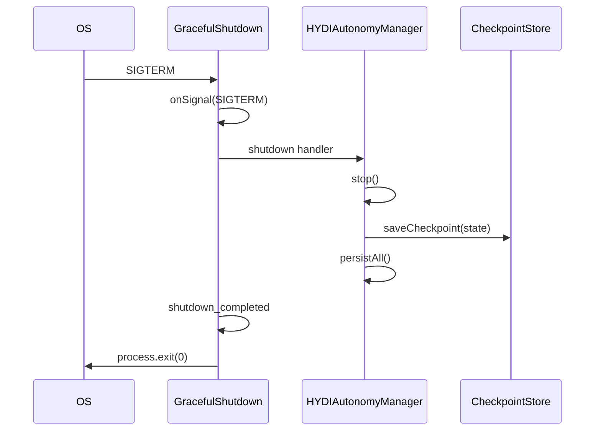
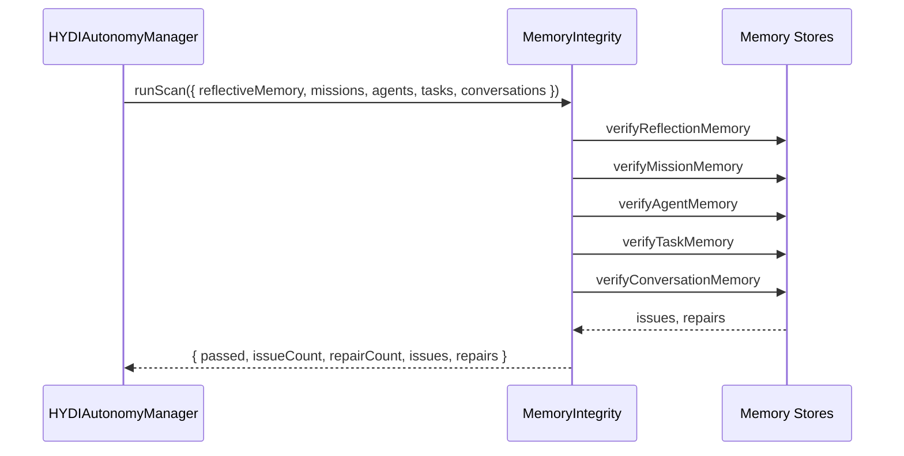

# HYDI V3 Sequence Diagrams

This document contains mermaid sequence diagrams for mission lifecycle, recovery, decision validation, and distributed scheduling.

## Mission Lifecycle

## Recovery Flow

## Decision Validation

## Distributed Scheduling

## Graceful Shutdown

## Memory Integrity Scan

