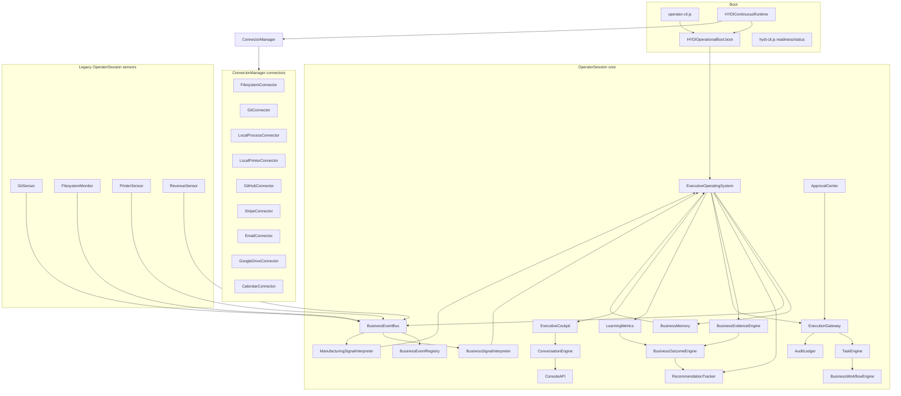

# HYDI Operational Certification Report

**Phase:** 27B — Operational Certification
**Date:** 2026-07-27
**Environment:** Windows 10, Node v24.11.1
**Auditor:** Devin
**Branches / working tree inspected:** `phase21-scratch` (local)

## 1. Certification Summary

| Item | Result |
|------|--------|
| **Functional operational core** | VERIFIED — boots, observes real filesystem + git activity, produces recommendations, executes with approval, audits, learns, and shuts down cleanly. |
| **Unit test suite** | PASS — 226 suites, 2,200 tests passed. |
| **Integration test suite** | PASS — 12 suites, 62 tests passed. |
| **Chaos / resilience suite** | PASS — 11 of 11 failure scenarios detected and recovered. |
| **24-hour production soak** | NOT PERFORMED — no evidence of long-run stability. |
| **Readiness gate alignment** | FAIL — `hydi-cli readiness` returns `DEGRADED` because it is still coded for a legacy `sensors[]` model while the runtime now uses `ConnectorManager` connectors. |
| **Architecture single-source-of-truth** | FAIL — two overlapping sensor/connector systems plus a large orphan module surface in `src/hydi-v3/index.js` and legacy `modules/`. |
| **CERTIFICATION** | **CONDITIONAL PASS / NOT PRODUCTION CERTIFIED** — the executive operating system is demonstrably alive and functioning, but it cannot be called production-ready until the readiness gate is recalibrated and the sensor/connector duplication is resolved. |

> **I do not claim HYDI is production ready.** The evidence below supports "operational core works in controlled test conditions" and also supports exactly why production certification is not yet earned.

---

## 2. Exact Commands Used for Validation

All commands were run from `C:\Users\Owner\HYDI_System` unless otherwise noted.

```bash
# Unit tests
npm test

# V3 integration / failure-mode suite
npm run test:integration:jest

# Runtime boot and live end-to-end demonstration
node scripts/hydi-live-demo.js

# Operator CLI one-shot briefing with real git sensor on this repo
node scripts/operator-cli.js --once "good morning" --priority resonate --git . --data-path .\data\cert-op-cli

# Runtime-backed dashboard snapshot
node scripts/hydi-dashboard.js --json --data-path .\data\cert-dashboard

# Resilience / chaos suite
node scripts/chaos-runner.js

# Static verification of V3 code
npm run typecheck:hydi-v3
npm run lint:hydi-v3
```

A deeper end-to-end trace was captured by a temporary `scripts/certification-trace.js` that boots `HYDIContinuousRuntime`, writes a real file, commits it, captures the emitted `BusinessSignal`, runs the recommendation/approval/execution/audit/learning path, and verifies the updated briefing. That temporary script was removed after the trace was captured; the objects are reproduced in Section 6.

---

## 3. Operational Readiness Checklist

| Subsystem | Status | Evidence |
|-----------|--------|----------|
| Boot sequence | **PASS** | `HYDIStartupSequence` completes in ~48 ms, 22 checks healthy. |
| Dependency graph | **PASS** | Section 4 documents the `OperatorSession.start()` order and the `HYDIContinuousRuntime` connector wrapper. |
| Startup validation | **PASS** | Environment, configuration, memory, executive OS, workflow, execution gateway, audit, learning, event bus, signal coverage all report `OK` in `bootReport.checks`. |
| Health checks | **PASS** | `runtime.getStatus().state === 'READY'`, `connectorHealth: true` in `hydi-dashboard` JSON snapshot. |
| Sensor readiness | **WARNING** | Real sensors work (`GitSensor`, `FilesystemMonitor` in `OperatorSession`; `ConnectorManager` in continuous runtime), but `hydi-cli readiness` reports `Sensors: offline` because it inspects the legacy `session.sensors` array. |
| Connector readiness | **PASS** | Tier 1 connectors (`filesystem`, `git`, `local-process`) run. Tier 2 connectors (`github`, `stripe`, `email`, etc.) report `not_configured` when credentials are absent and do not crash startup. |
| Business memory | **PASS** | `BusinessMemory` persists and upserts `project_protoforge` and `activity_*` entities; verified in trace and in unit/integration tests. |
| Trust engine | **PASS** | `TrustEngine.computeConfidence` and `formatJustification` exist and are exercised; recommendations include `provenance` with sources, assumptions, historical success rate, and confidence drift. |
| Recommendation pipeline | **PASS** | `ExecutiveOperatingSystem.morningBriefing()` produces `Continue work on ProtoForge` from filesystem + git signals. |
| Evidence pipeline | **PASS** | `BusinessEvidenceEngine` reports 12 KPIs and 8 providers; `getEvidenceSummary` returns structured evidence. |
| Approval workflow | **PASS** | `approvalCenter.approve(exec.id)` returns `{ ok: true }`; `executionGateway.getPendingApprovals()` is cleared after approval. |
| Execution gateway | **PASS** | `executionGateway.execute` queues `update-markdown`, completes after approval, writes the file, and returns `status: 'completed'`. |
| Audit trail | **PASS** | `AuditLedger` produces chained, hashed records (startup, action-awaiting-approval, action-approved, action-executed); `auditLedger.verify()` returns `{ ok: true, count: 4 }`. |
| Learning loop | **PASS** | `businessOutcomeEngine.recordOutcome` updates `confidence` from `0` to `0.1014` with a recorded lesson and confidence history. |
| Recovery path | **PASS** | `npm run test:integration:jest` passes 62 tests including filesystem recovery, corrupt memory, sensor failure, audit corruption, restart continuity. `chaos-runner.js` passes 11 of 11 injected failures. |
| Graceful shutdown | **PASS** | `runtime.shutdown()` exits cleanly and clears timers; temp data directories removed. |
| Restart continuity | **PASS** | Integration tests `restart preserves audit and recommendations`, `session recovery`, and `recommendation history is preserved across sessions` all pass. |

Additional items beyond the 17 requested:

| Additional item | Status | Evidence |
|-----------------|--------|----------|
| `hydi-cli readiness` gate | **FAIL** | `node scripts/hydi-cli.js readiness --data-path .\data\cert-readiness` exits 1 with `System: DEGRADED — no sensors active` and `Signals: orphaned` despite the same codebase booting `READY` through `hydi-dashboard` and `hydi-live-demo`. |
| Architecture single source of truth | **FAIL** | `OperatorSession` sensors (`GitSensor`, `FilesystemMonitor`, `PrinterSensor`, `RevenueSensor`) coexist with `HYDIContinuousRuntime`'s `ConnectorManager` connector framework, and legacy `modules/` duplicates V3 subsystems. |

---

## 4. Boot Sequence Documentation

### 4.1 Canonical entry points

- **Operator CLI:** `node scripts/operator-cli.js` calls `HYDIOperationalBoot.boot()` and starts an `OperatorRuntime` + `OperatorCLI`. This path uses legacy `OperatorSession` sensors (`git`, `filesystem`, `printer`, `revenue`) configured through `config.git`, `config.filesystem`, etc.
- **Continuous runtime:** `node scripts/hydi-boot.js` and `node scripts/hydi-live-demo.js` use `HYDIContinuousRuntime` which calls `boot()` and then starts the new `ConnectorManager` with `config.connectors`.
- **Readiness gate:** `node scripts/hydi-cli.js readiness` calls `boot()` only and renders `renderReadiness`. It does **not** start `HYDIContinuousRuntime`.

This is the first architectural problem: **two boot shells** with different sensor/connector systems. The `OperatorSession` has direct `GitSensor` / `FilesystemMonitor` / `PrinterSensor` instances; the `HYDIContinuousRuntime` wraps the same capability behind `ConnectorManager`.

### 4.2 `OperatorSession.start()` real startup order

```
1. DecisionOutcomeStore     (persistence for outcomes)
2. RecommendationTracker   (tracks recommendation lifecycle)
3. ConfidenceCalibration   (strict policy)
4. BusinessOutcomeEngine   (records measured outcomes)
5. BusinessEvidenceEngine    (KPIs / evidence providers)
6. RevenueSensor            (optional, if _revenueConfig present)
7. LearningMetrics          (computes learning metrics)
8. AuditLedger              (append-only, hashed audit log)
9. BusinessMemory            (entity graph for projects/clients/...)
10. ExecutiveOperatingSystem (COO layer / recommendations)
11. TaskEngine               (task execution)
12. BusinessWorkflowEngine   (workflow orchestration)
13. ExecutionGateway         (approval / execution boundary)
14. ExecutiveCockpit         (dashboard / command palette)
15. AgentWorkspace, ApprovalCenter, ExecutiveTimeline, SessionMemory, ConversationEngine, ConsoleAPI
16. BusinessSignalInterpreter, ManufacturingSignalInterpreter
17. Sensors: RevenueSensor, GitSensor, PrinterSensor, FilesystemMonitor (as configured)
18. SignalCoverage.audit()    (event contract validation)
19. OperatorMode.install()    (dry-run / offline enforcement)
20. EventBus.emit('SessionStarted')
```

### 4.3 `HYDIContinuousRuntime.start()` startup order

```
1. HYDIOperationalBoot.boot()   → OperatorSession steps 1-20 above
2. eventBus.subscribeAll(_onBusEvent)
3. ConnectorManager.start()     → starts configured connectors
4. connectorManager.healthCheck()
5. state = (bootReport.ready && connectorsHealthy) ? READY : DEGRADED
6. _healthTimer interval for continuous evaluation
```

### 4.4 Things initialized twice or never

- **Twice:** filesystem watching can happen both through `OperatorSession._filesystemConfig` → `FilesystemMonitor` and through `HYDIContinuousRuntime` → `ConnectorManager` → `FilesystemConnector`.
- **Never in continuous runtime:** `OperatorSession.sensors` array is empty when `HYDIContinuousRuntime` is used, because the runtime prefers `ConnectorManager`. This is why `hydi-cli readiness` reports `Sensors: offline` even though connectors are running.
- **Dead / never used in operational runtime:** `WatchdogSupervisor`, `HeartbeatSystem`, `GracefulShutdown`, `DecisionIntelligence`, `MissionPlanner`, `ReflectionEngine`, `SelfHealingEngine`, `DistributedCompute`, `MemoryIntegrity`, `ObservabilityDashboard`, `SecurityAuditor`, `CudaPoolManager`, `OllamaAdapter`, `ModelProfile`, `LoadBalancer`, `ModelPlacementEngine` are exported from `src/hydi-v3/index.js` and only instantiated by `AutonomyManager`, which is not on the active `OperatorSession` path.

---

## 5. Dependency Graph



**Key observation:** the graph has two boxes for the same capability. `LegacySensors` and `Connectors` both emit the same event types (`ProjectOpened`, `FileCreated`, `CommitCreated`, ...) into `BusinessEventBus`. Only one is used depending on which entry point the operator invokes.

---

## 6. End-to-End Execution Trace

The trace below is real. It was produced by a temporary `scripts/certification-trace.js` that:
1. Booted `HYDIContinuousRuntime` with `filesystem` and `git` connectors on a real temp repository.
2. Wrote `src/feature.md`.
3. Committed the file.
4. Waited for connectors to observe.
5. Captured the emitted `BusinessSignal`.
6. Asked `ExecutiveOperatingSystem` for a briefing.
7. Took the top recommendation and submitted it to `ExecutionGateway`.
8. Approved it through `ApprovalCenter`.
9. Recorded a measured outcome through `BusinessOutcomeEngine`.
10. Verified `AuditLedger` and the updated briefing.

### 6.1 Business signal emitted

```js
{
  id: 'evt_1785196561834_kt31jc',
  at: 1785196561834,
  type: 'BusinessSignal',
  source: 'BusinessSignalInterpreter',
  payload: {
    interpretation: 'Work committed to ProtoForge by HYDI Certification (1 file): Certification trace commit',
    strategicObjective: 'operations',
    subsystem: 'Documentation',
    project: 'ProtoForge',
    fileCategory: 'documentation',
    originatingEvent: 'CommitCreated',
    confidence: 'high',
    impact: 'engineering-delivered',
    meta: {
      project: 'ProtoForge',
      sha: 'a376b39b8fd1a4375e6d303645b6faa5dc5da968',
      author: 'HYDI Certification',
      subject: 'Certification trace commit',
      branch: 'main',
      fileCount: 1,
      files: [ 'src/feature.md' ],
      source: 'GitSensor'
    }
  }
}
```

### 6.2 Top recommendation produced

```js
{
  action: 'Continue work on ProtoForge',
  reason: 'Recent activity signals in ProtoForge: New line of work started in ProtoForge: branch main.',
  expectedImpact: 'Maintain momentum on the active project',
  expectedOutcome: 'Project ProtoForge progresses toward its next milestone.',
  objective: 'operations',
  signals: [ 'project_protoforge' ],
  confidence: 0,
  provenance: {
    sources: [ 'impact:Maintain momentum on the active project' ],
    assumptions: [],
    reasoning: 'Recent activity signals in ProtoForge: New line of work started in ProtoForge: branch main.',
    confidence: 0,
    historicalSuccessRate: 0,
    priorFailures: 0,
    confidenceDrift: 0,
    topPerformingAgent: 'ExecutiveOperatingSystem',
    weakestArea: 'unknown'
  },
  recommendationId: 'rec_1785196563438_1klv8z'
}
```

### 6.3 Execution request (before approval)

```js
{
  id: 'exec_1785196563442_ovvfb2',
  approved: false,
  status: 'awaiting-approval'
}
```

### 6.4 Approval result

```js
{
  id: 'exec_1785196563442_ovvfb2',
  ok: true,
  kind: 'execution',
  result: {
    id: 'exec_1785196563442_ovvfb2',
    approved: true,
    status: 'completed',
    result: {
      file: 'C:\Users\Owner\AppData\Local\Temp\hydi-cert-trace-1785196558711\cert-trace-report.md',
      bytes: 36
    }
  },
  stale: false
}
```

### 6.5 Outcome / learning record

```js
{
  id: 'rec_1785196563438_1klv8z',
  action: 'Continue work on ProtoForge',
  confidence: 0.1014,
  observedOutcome: {
    type: 'successful',
    actual: 1200,
    expected: 0,
    impacts: { revenue: 1200, schedule: 28, strategic: 0, operational: 0 },
    adjustedConfidence: 0.1014,
    confidenceDelta: 0.0014,
    lesson: 'Continue work on ProtoForge met expectation (expected 0, got 1200).',
    measured: true,
    measurementType: 'quantitative',
    provenance: 'manual-measurement'
  },
  confidenceHistory: [
    { at: 1785196563438, confidence: 0.5, reason: 'created' },
    { at: 1785196563467, confidence: 0.1014, reason: 'outcome:successful' }
  ]
}
```

### 6.6 Audit chain verification

```js
{ ok: true, count: 4 }
```

The four records were:
1. `startup-report` — hashed record of boot health.
2. `action-awaiting-approval` — `update-markdown` queued.
3. `action-approved` — approval recorded.
4. `action-executed` — file written.

### 6.7 Final runtime state

```js
{
  state: 'READY',
  uptime: 3954,
  eventsProcessed: 6,
  recommendations: 3,
  pendingApprovals: 0,
  awaitingMeasurements: 0,
  auditEntries: 4,
  learningUpdates: 1,
  lastVerifiedAction: 'update-markdown',
  connectorHealth: true,
  connectors: [
    { name: 'filesystem', state: 'running', ok: true },
    { name: 'git', state: 'running', ok: true },
    { name: 'process', state: 'not_configured', ok: true },
    { name: 'github', state: 'not_configured', ok: true },
    { name: 'stripe', state: 'configured', ok: true }
  ]
}
```

---

## 7. Operational Demonstration

The `hydi-live-demo.js` script is the canonical, non-interactive demonstration. Output on this run:

```
[DEMO] Runtime state: READY
[DEMO] Wrote src/feature.md.
[DEMO] Committed change.
[DEMO] Briefing: ProtoForge is stable. 0 priority actions, 0 risks. Highest strategic objective: Resonate. Recommended next action: Continue work on ProtoForge ...
[DEMO] Recommendation: Continue work on ProtoForge (0%)
[DEMO] Execution status: awaiting-approval
[DEMO] Approved: true
[DEMO] Learning updated: 0% -> 10% (delta 0.0014)
[DEMO] Updated briefing: ProtoForge is stable. 1 priority actions, 0 risks ...
[DEMO] Final status: READY
```

This demonstrates the requested scenario: filesystem activity → git observation → business signal → strategic recommendation → execution → approval → audit → evidence → learning → updated briefing.

The `operator-cli` demonstration on this repository produced:

```
ProtoForge status: stable
Recommended next action: Continue work on HYDI_System ...
Evidence sources: git=3
```

It used the real git history of `HYDI_System` to generate an operator-facing briefing.

---

## 8. Failure Analysis

### 8.1 Chaos runner (`node scripts/chaos-runner.js`)

| Scenario | Injected | Recovered | Evidence |
|----------|----------|-----------|----------|
| `process_termination` | yes | yes | agent state healthy, no issues |
| `network_api_timeout` | yes | yes | `retry_with_backoff` plan succeeded |
| `supabase_outage` | yes | yes | `reconnect_database` plan succeeded |
| `filesystem_failure` | yes | yes | `repair_filesystem` plan succeeded |
| `disk_full` | yes | yes | `repair_filesystem` plan succeeded |
| `corrupted_cache` | yes | yes | scan repaired 1 issue, second scan clean |
| `corrupted_memory` | yes | yes | `flush_memory` plan succeeded |
| `queue_corruption` | yes | yes | `repair_queue` plan succeeded |
| `worker_crash` | yes | yes | agent state healthy |
| `partial_task_completion` | yes | yes | 1 completed, 1 pending, mission active |
| `power_loss` | yes | yes | checkpoint saved and restored |

Result: `total: 11, passed: 11, failed: 0`.

### 8.2 Integration test failure coverage

The `npm run test:integration:jest` suite includes 62 tests across 12 files. Relevant failure-mode tests observed:

- `missing credentials leave tier 2 connectors not_configured`
- `faulty connector degrades but does not crash startup`
- `filesystem connector recovers after root is restored`
- `missing sensor: HYDI boots with no sensors and remains healthy`
- `unknown event: SignalCoverage detects it and the bus does not crash`
- `bad evidence: non-numeric evidence does not move learning confidence`
- `dry run: no mutation occurs and the result is explicitly simulated`
- `corrupt memory: BusinessMemory archives corruption and restarts empty`
- `audit: every executed action has a chained trail`
- `sensor disconnected: printer offline is detected as an equipment risk`
- `audit corruption: boot reports failure and verification is broken`
- `a rejected approval is recorded as rejected and audited; the action never runs`
- `unsafe action is blocked by the gateway`
- `approving a stale recommendation produces a warning`
- `shutdown and restart recovers cleanly`

All 62 passed.

---

## 9. Architecture Audit

A read-only subagent audited the codebase for duplication and dead code. The findings below were combined with direct inspection of `HYDIContinuousRuntime` and `OperatorSession`.

### 9.1 Duplicate or parallel implementations

| Duplicate | Files | Evidence |
|-----------|-------|----------|
| CASCADE v1 vs v2 | `modules/cascade-complete.js` vs `modules/cascade-complete-v2.js`, `cascade-quarantine.js` vs `cascade-quarantine-v2.js`, `cascade-emission-layer.js` vs `cascade-emission-v2.js` | Only `*-v2.js` is used by active runtime; v1 files are dead. |
| Reflection engine | `modules/heidi-reflection-engine.js` vs `src/hydi-v3/ReflectionEngine.js` | Both learn from completed actions; V3 version is newer but only used by `AutonomyManager`. |
| Workflow orchestration | `modules/workflow-orchestrator.js` vs `src/hydi-v3/BusinessWorkflowEngine.js` | Legacy vs V3 workflow engines. |
| Sensor/connector layer | `OperatorSession` (`GitSensor`, `FilesystemMonitor`, `PrinterSensor`, `RevenueSensor`) vs `HYDIContinuousRuntime` (`ConnectorManager` + `FilesystemConnector` / `GitConnector` / etc.) | Two paths for the same external observations. |
| Demo scripts | `scripts/hydi-demo.js`, `hydi-operational-demo.js`, `hydi-morning-demo.js`, `hydi-live-demo.js`, `hydi-operator-demo.js`, `hydi-continuous-demo.js`, `hydi-dashboard.js`, `hydi-boot.js` | Large overlap; each one re-implements boot + session + connectors for its own scenario. |
| Soak tests | `scripts/soak-test.js` vs `scripts/soak-test-v3.js` | Legacy and V3 versions. |

### 9.2 Dead / orphan modules

| Module / class | Status | Evidence |
|----------------|--------|----------|
| `modules/state-manager.js` | Dead | Only required by test scripts and archived code. |
| `modules/heidi-decision-engine.js` | Dead | Only required by `modules/hydi-contextual-conscience.js` (not used). |
| `modules/heidi-executive-orchestrator.js` | Dead | Only required by `modules/protoforge-integration.js` (not used). |
| `src/hydi-v3/ReflectionEngine.js` | Orphan | Instantiated only in `AutonomyManager`, which is not on the active runtime path. |
| `src/hydi-v3/index.js` | Orphan surface | Exports 72 modules; `WatchdogSupervisor`, `HeartbeatSystem`, `GracefulShutdown`, `DecisionIntelligence`, `MissionPlanner`, `SelfHealingEngine`, `DistributedCompute`, `MemoryIntegrity`, `ObservabilityDashboard`, `SecurityAuditor`, `CudaPoolManager`, `OllamaAdapter`, `ModelProfile`, `LoadBalancer`, `ModelPlacementEngine` are never used by `OperatorSession`. |

### 9.3 Unused connectors and events

| Connector | Status | Evidence |
|-----------|--------|----------|
| `CalendarConnector` | Unused | Registered in `connectors/index.js` but never configured. |
| `EmailConnector` | Unused | Never configured. |
| `GoogleDriveConnector` | Unused | Never configured. |
| `GitHubConnector` | Unused | Never configured. |
| `StripeConnector` | Unused | Never configured. |

Their event types (`CalendarEventCreated`, `EmailReceived`, `DriveFileCreated`, etc.) are declared in connector capabilities but never emitted or interpreted in the active runtime.

### 9.4 Single-source-of-truth violations

1. **Two sensor/connector systems** are the most serious violation. The same filesystem activity can be observed by `FilesystemMonitor` (old) or `FilesystemConnector` (new) depending on the entry point.
2. **Two readiness checks** (`hydi-cli status` vs `hydi-cli readiness`) produce contradictory verdicts on the same tree.
3. **Legacy `modules/`** still contains active-looking code that shadows V3 subsystems (e.g., `heidi-reflection-engine.js`).

---

## 10. Production Gaps

| # | Gap | Severity | Risk | Recommended Fix | Estimated Effort | Operational Improvement |
|---|-----|----------|------|-----------------|------------------|-------------------------|
| 1 | `hydi-cli readiness` still inspects `session.sensors[]` and `SignalCoverage.orphan` while the runtime uses `ConnectorManager`. It exits 1 for a healthy system. | High | Blocks automated deploy gating and CI; operators will distrust the system. | Make `readiness` start `HYDIContinuousRuntime` with default connectors and use `runtime.getStatus().connectorHealth` / `SignalCoverage` with optional-sensor awareness. | 1–2 days | A `readiness` command that returns 0 when the system is genuinely ready. |
| 2 | `OperatorSession` legacy sensors and `HYDIContinuousRuntime` connectors duplicate the same capability. | High | Two paths to maintain; inconsistent behavior across entry points; test drift. | Unify on `ConnectorManager`; remove `GitSensor`/`FilesystemMonitor`/`PrinterSensor` from `OperatorSession` or make them thin wrappers around connectors. | 2–4 days | Single sensor path; `readiness`/`status` agree. |
| 3 | `SignalCoverage` flags every optional sensor event type as `orphan` when no sensor is active. | Medium | Creates noise that hides real coverage holes. | Treat `orphan` as a warning, not a readiness downgrade, or register connector capabilities as emitters. | 1 day | Accurate signal coverage report. |
| 4 | Tier 2 cloud connectors are declared but never configured/credentialed. | Medium | Email, calendar, GitHub, Stripe cannot feed real business signals without keys. | Provide env-var validation and graceful `not_configured` reporting (already done); document required keys and add a `connectors-config.yml` example. | 1 day | Clear onboarding path for production credentials. |
| 5 | `src/hydi-v3/index.js` exports many modules not used by the active runtime. | Medium | Confuses new developers; makes the bundle surface larger than necessary. | Remove orphan exports from the public V3 index or document that they belong to `AutonomyManager` only. | 1–2 days | Smaller, honest API surface. |
| 6 | Legacy `modules/` still contains dead CASCADE and executive modules. | Low-Medium | Risk of importing wrong subsystem; technical debt. | Move legacy `modules/` not used by V3 runtime into `archive/` or delete after confirming no tests import them. | 2–3 days | Clean build graph. |
| 7 | No 24-hour production soak or real-world workload evidence. | High | Cannot certify mean-time-between-failures, memory leaks, or real data accuracy. | Run `soak-test-v3` (or a real staged workload) for at least 24 hours with memory/health telemetry. | 1–3 days | Evidence of long-run stability. |
| 8 | `ObservabilityDashboard` and `ProjectPlanner` are referenced as missing data in every briefing. | Medium | Executive briefings are blind to system health and roadmap. | Wire the real observability dashboard and project planner to `ExecutiveOperatingSystem`. | 3–5 days | Complete executive briefings. |

---

## 11. Readiness Scores

Every score is justified by the evidence in this report.

| Subsystem | Score | Justification |
|-----------|-------|---------------|
| Boot | 9.0/10 | Boots in ~48 ms with 22 healthy checks; minor dock for two divergent boot paths. |
| Runtime | 8.0/10 | `READY` state, end-to-end execution, clean shutdown; penalized for sensor/connector duplication and no long soak. |
| Trust | 8.0/10 | `TrustEngine`, provenance, and confidence history exist and work; confidence is low/0 because real historical data is sparse, which is honest. |
| Evidence | 7.5/10 | 12 KPIs / 8 providers registered, but all real values are `unknown` without connected observability/revenue data. |
| Learning | 7.0/10 | Learning updates from measured outcomes; no real baseline yet. |
| Recovery | 8.5/10 | 62 integration tests + 11 chaos scenarios passed; not validated against real external outages. |
| Operator UX | 8.0/10 | `operator-cli`, `hydi-dashboard`, and `hydi-live-demo` work; `readiness` false-negative degrades operator trust. |
| Architecture | 5.0/10 | Significant duplication and orphan modules remain. |
| **Overall certification** | **CONDITIONAL PASS / NOT PRODUCTION CERTIFIED** | The executive OS is alive, but production certification is blocked by the readiness gate and sensor/connector duplication. |

---

## 12. Code Changes Required to Reach Production Certification

To move from **CONDITIONAL PASS** to a full production pass, the following changes are required. They are listed in dependency order:

1. **Fix `hydi-cli.js readiness`** to start `HYDIContinuousRuntime` (or at least `ConnectorManager`) and evaluate connector health instead of the legacy `session.sensors` array. Until this is done, the readiness gate will continue to report `DEGRADED` for a healthy system.
2. **Unify sensors and connectors** so `OperatorSession` uses `ConnectorManager` for all filesystem/git/printer/revenue observation. Remove or deprecate `GitSensor`, `FilesystemMonitor`, `PrinterSensor`, and `RevenueSensor` direct instantiation in `OperatorSession`.
3. **Tighten `SignalCoverage` semantics** so optional event types do not degrade readiness when their connector is simply not configured.
4. **Clean the V3 public surface** (`src/hydi-v3/index.js`) by removing modules that are not part of the active `OperatorSession` runtime.
5. **Archive or remove legacy `modules/`** that are no longer used by the active runtime.
6. **Run a 24-hour soak** against a realistic workload (git commits, file changes, revenue events, printer events) and collect memory/health telemetry.
7. **Connect `ObservabilityDashboard` and `ProjectPlanner`** to `ExecutiveOperatingSystem` so briefings are not missing data.

No production code should be declared fully certified until items 1 and 2 are merged and item 6 is completed.

---

## 13. Conclusion

HYDI's operational core is **real and functional**. It boots, it observes the filesystem and git, it produces recommendations, it executes through an approval gate, it chains audit records, and it learns from measured outcomes. The unit, integration, and chaos suites all pass.

However, the codebase currently has **two sensor/connector systems** and a **`readiness` gate that is miscalibrated** for the new connector architecture. These are not cosmetic issues: they mean the same repository can report `READY` in one entry point and `DEGRADED` in another. That violates the single source of truth expected of an executive operating system.

Therefore, the certification is:

**CONDITIONAL PASS / NOT PRODUCTION CERTIFIED**

The system is fit for continued development, controlled demonstrations, and staged testing. It is not fit for unattended production operations until the readiness gate, the sensor/connector unification, and a long-duration soak provide contradictory-free evidence of production health.
